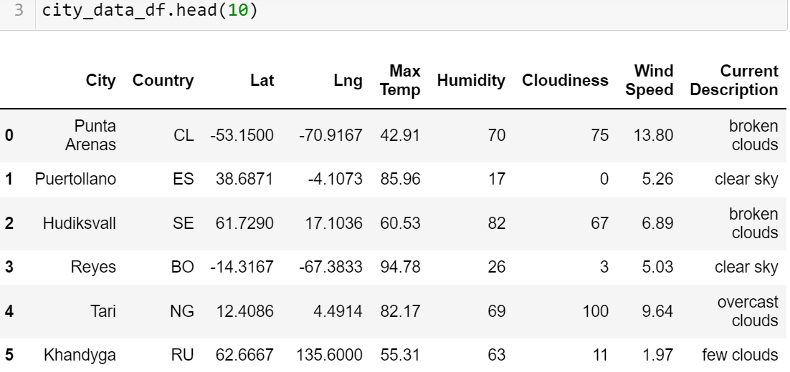
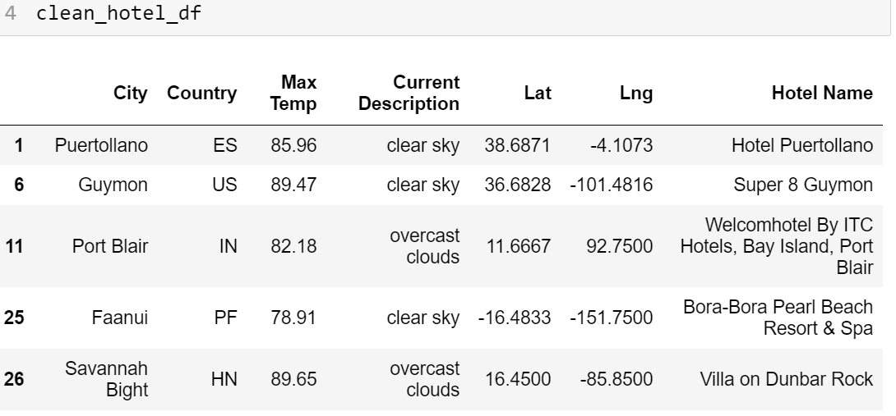
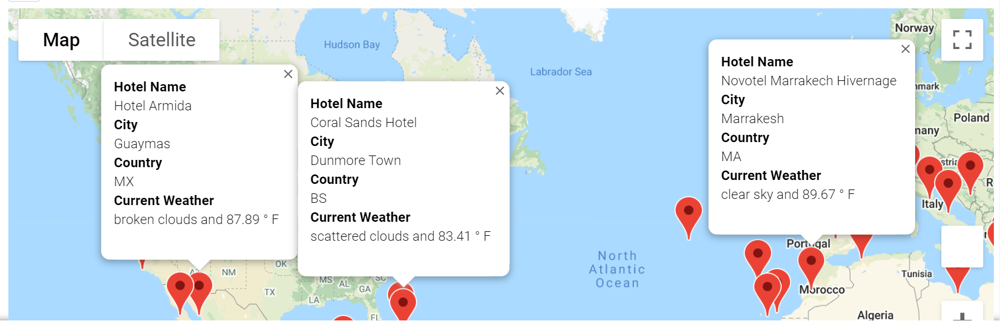
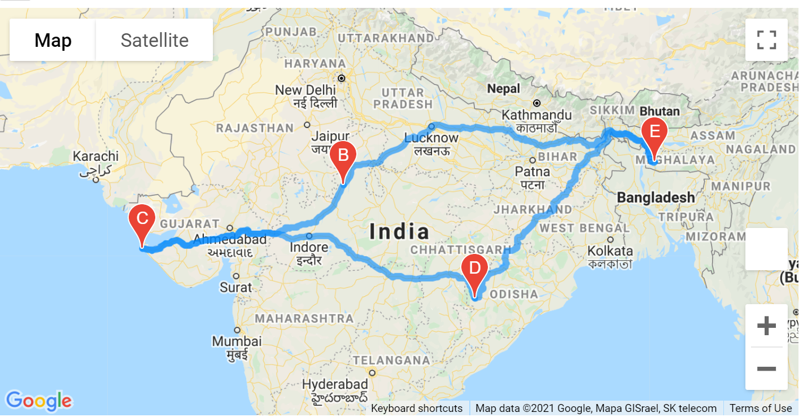
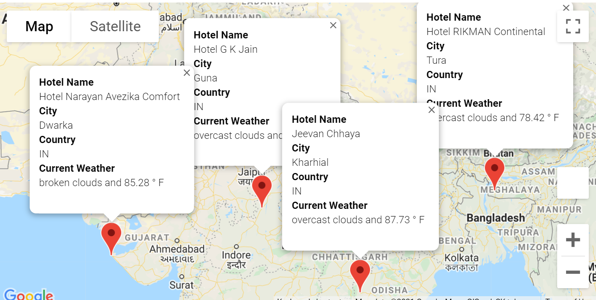

# World_Weather_Analysis

### **Objective**
The objective of this project is to learn the analysis and visualization of a specific dataset retrieved from API (Application Programming Interface). We retrieved data from two API sources, OneWeatherMap.org and Google Maps Platform. We helped generate a user interface for the customers of a travel technology company, **PLANMYTRIP** that specializes in internet related services in the hotels and lodging industry. We helped Jack, the head of the analysis for user interface team, to collect and present the data for customers via the search page. The customers visiting the page will filter their search based on their preferred travel criteria in order to find their favorite cities around the world.

### **Analysis and Results**

We used the jupyter notebook and the citipy module to get the cities of more than 500 random latitudes and longitudes around the world. We performed our tasks the following way after generating the latitudes and longitudes. 

### 1. Collect the Weather Data

- Perform request from OpenWeather Map API and retrieve the JSON weather data from these cities. 

- The weather data is added to a Pandas DataFrame.

- Used Matplotlib to create a series of scatter plots to see the relationships between the latitude and a variety of weather parameters such as humidity, maximum temperature, cloudiness and wind speed of more than 500 cities around the world.

- We did statistical calculation on our data using linear regression on the weather parameters in the Northern and Southern Hemisphere.

- This result would help the team in the travel company plan the best time of the year and location to plan the trips for the clients.

- We exported the data, clean it and the used the weather data to plan the best cities to plan an ideal vacation based on certain weather criteria.

- We mapped these cities by using jupyter gmaps and the Google Places API.

### **Deliverable 1: Retrieve Weather Data**
**Summary:** 
- We created 2000 random latitudes and longitudes and obtained the nearest city using the _citypy_ module. 
- We performed an API call with the OpenWeatherMap and retrieved the following information from the API JSON (_JavaScript Object Notation_)  file:

    - Latitude, Longitude
    - Maximum temperature
    - Percent humidity
    - Percent cloudiness
    - Wind Speed 
    - Weather description (for example, foggy, light rain, etc.)

- We created a CSV file, _WeatherPy_Database.csv_ and stored it in _Weather_Database folder_.

- We created a DataFram showing the results. See Fig. 1 below.

**Fig 1:** The top five rows showing the weather parameters of different latitude and longitude pairs in a DataFrame.

### **Deliverable 2**

**Summary:**

We did the following for a Vacation destination search:
- We used the input from customer for their preferred temperature range for vacation city. 

- We created a DataFrame based on the minimum and maximum temperature range. 

- We retrieved hotel names and added those in the DataFrame. We cleaned up the rows that did not have any hotels near these cities using the _loc_ method. The DataFrame is shown in Fig 2 below. The DataFrame is saved in _WeatherPy_vacation.csv_ file. 

**Fig 2:** The top five rows of the DataFrame based on the search criteria of the customer's  input of minimum and maximum temperature.

- We created a marker layered map with pop-up markers using Google Map. See Fig 3 below. 

**Fig 3:** The marker layer map with pop-up markers showing the hotel name, city, country and the current weather with maximum temperature. 

### **Deliverable 3**

We create a travel itinerary for a customer in India using Google Directions API. We chose four cities in India and mapped a driving trip. The cities are, Tura (start A and end E point), Guna (B), Dwarka (C) and Kharhial (D). 

**Summary:**

- We created four DataFrames, one for each city on the itinerary. 

- We created a latitude and longitude pairs for each of the four cities. 

- We made a directions map between the four cities and saved the figure (shown in Fig 4 below). The directions is for driving for the convenience of the traveler.

**Fig 4:** The figure shows driving directions of four cities in India.

- Finally, we made a layer map with pop-up marker for the cities on the intenerary  as shown in Fig 5 below. The markers show the hotel name, city, country and current with the temperature. 

**Fig 5:** The figure shows a map with pop-up marker showing information that a customer would want to know when making a decision to visit a city.
